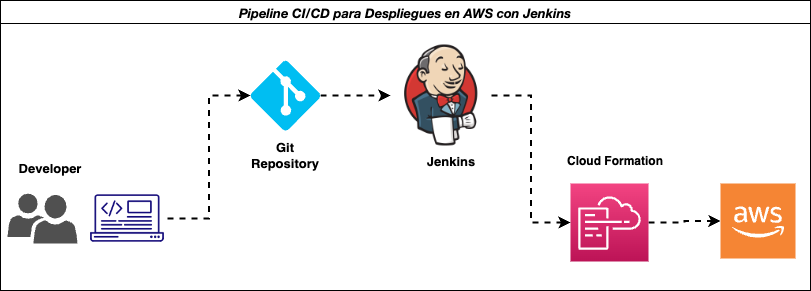

#  ✅ 🆓 Pipeline CI/CD para Despliegues en AWS con Jenkins
En el siguiente repositorio se encuentra las fuentes de una aplicación Spring Boot simple para luego realizar la compilación mediante un pipeline de Jenkins cada vez que se envié un nuevo cambio a nuestro repositorio Git. Cabe mencionar que realizaremos un despliegue en AWS utilizando CloudFormation para construir un Bucket S3.
## Badges

            

        

## Contributing

Contributions are always welcome!

See `readme.md` for ways to get started.

Please adhere to this project's `code of conduct`.

## Diagrama Proyecto

## Feedback

If you have any feedback, please reach out to us at c.caldas.m@gmail.com